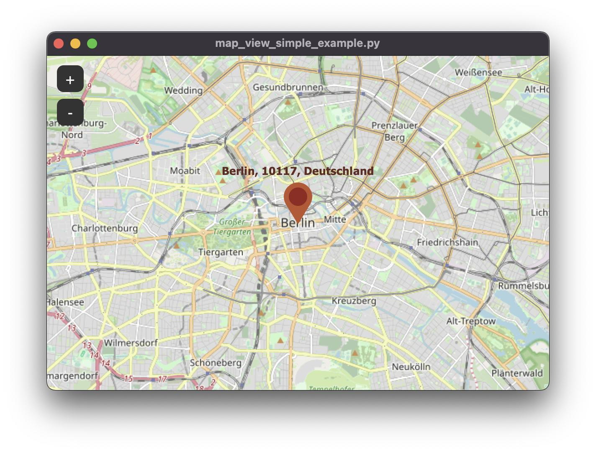

# Crear mapas tkinter en una sola línea :)


### Instalación desde CMD o Powershell

```bash
git clone https://github.com/Santserrano/build-maps-tkinter.git

```

### Instalación de dependencias

```bash
pip install -r requirements.txt

```

### Cómo usar (explicado con peras y manzanas)

Clone el repositorio en su carpeta de proyecto e importe las funciones necesarias en `main.py` o su archivo de preferencia.
En la parte superior del código, pegue la siguiente instrucción:

```bash
from engine.functions import mapa

```

Cree una variable para almacenar la ventana y llame a la función `mapa` pasando los siguientes argumentos.
Se muestra del ejemplo `ejemplo.py`:

```bash

ventana = mapa(titulo, ancho, alto, coord_inicial, zoom_inicial, marcador_1, marcador_2)


```

Una muestra completa sobre una implementación correcta:
```bash
#Crear un mapa
titulo = "Título de la ventana"    #Modifique el titulo
ancho = 856                        # Ancho de la ventana
alto = 645                         # Alto de la ventana
coord_inicial = (-30.95, -59.04)   # Posición del mapa
zoom_inicial = 7                   # 'Acercamiento' de la vista
marcador_1 = (-32.94, -60.63)      # Marcador de la posición 1
marcador_2 = (-29.18, -58.06)      # Marcador de la posicion 2

ventana = mapa(titulo, ancho, alto, coord_inicial, zoom_inicial, marcador_1, marcador_2)

#Correr la ventana
ventana.run()

```